<!-- Custom animated hero banner (villain / comic-noir palette) -->

<!-- Animated typing line -->

  
  
  

---

### 🧑‍💻 About Me

<table>
<tr>
<td width="60%" valign="top">

- 🌏 Full-Stack Web Developer based in **Pandacan, Manila, Philippines**
- 🛠️ Main stack: **Laravel · Vue.js · Next.js (App Router) · TypeScript · MySQL**
- 🎓 BSIT graduate (**Cum Laude**), Universidad De Manila
- 📜 CSC Professional Level II eligible · multiple TESDA certifications
- 🚀 I turn business requirements into reliable, maintainable, user-friendly web apps
- 🔧 I also enjoy refactoring existing systems — clearer UI, smoother workflows, better performance
- 🎭 On heavy rotation while coding: **MF DOOM** — villain music for villain-grade code
- 📫 Reach me at **renzdiaz.contact@gmail.com**

</td>
<td width="40%" align="center" valign="middle">

</td>
</tr>
</table>

 

### 🧠 Tech Stack

  

 

### 🚀 Featured Work

<table width="100%">
  <tr>
    <td width="50%" valign="top">
      <h4>🏢 PrimeOutsourcing — Project Management App</h4>
      
Laravel + Vue.js platform with admin, developer, and client roles. Built the corporate landing page, financial tracking UI, proposal workflow (with an accept/reject admin review flow), and a role-conditional dashboard shell.

      
    </td>
    <td width="50%" valign="top">
      <h4>🎥 WebiMix — Webinar Hosting Platform</h4>
      
Next.js + Supabase platform for hosting webinars for Filipino users — webinar management, registration, certificates, a scheduling planner with overlap detection, and a speaker hub. Security-hardened with rate limiting, sanitization, and IDOR-safe ownership checks.

      
    </td>
  </tr>
  <tr>
    <td width="50%" valign="top">
      <h4>🌐 Personal Portfolio</h4>
      
Multi-iteration portfolio site — from a dark indigo/violet/cyan theme with a Three.js interactive globe and magnetic cursor, to a serif-heavy corporate redesign with a Manila map marker and AJAX contact form.

      
    </td>
    <td width="50%" valign="top">
      <h4>📌 More on GitHub</h4>
      
Check out the full list of repositories and pinned projects on my profile for more hands-on work across frontend, backend, and full-stack builds.

      
    </td>
  </tr>
</table>

 

### 📊 GitHub Stats

  
  

  

 

### 🐍 Contribution Snake

<!--
  This animation is generated by a GitHub Action (Platane/snk), NOT by
  pasting an image link alone. See the "snake.yml" workflow file that
  goes with this README for the setup steps — it commits the SVG below
  to an "output" branch on a schedule.
-->

  <picture>
    <source media="(prefers-color-scheme: dark)" srcset="https://raw.githubusercontent.com/Znerzi/Znerzi/output/github-contribution-grid-snake-dark.svg" />
    <source media="(prefers-color-scheme: light)" srcset="https://raw.githubusercontent.com/Znerzi/Znerzi/output/github-contribution-grid-snake.svg" />
    
  </picture>

 

### 🤝 Connect With Me

  
  
  

